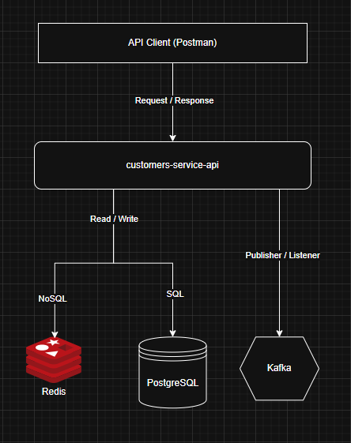

# Customer Management API

API para gerenciamento de clientes e seus endereços.

## 📋 Visão Geral

Este projeto é uma API RESTful desenvolvida em Java com Spring Boot para gerenciar informações de clientes. A API permite criar,
consultar, atualizar clientes e seus endereços.

## 🚀 Tecnologias Utilizadas

* **Java 21**: Linguagem de programação.
* **Spring Boot 3.5.13**: Framework para desenvolvimento da aplicação.
* **PostgreSQL**: Banco de dados relacional.
* **Flyway**: Ferramenta de migração de banco de dados.
* **OpenAPI (Swagger)**: Especificação e documentação da API.
* **Gradle**: Ferramenta de automação de build.
* **MapStruct**: Mapeamento de objetos (DTO <-> Entity).
* **Lombok**: Redução de código boilerplate.
* **JUnit 5 & Mockito**: Testes unitários.

## 🛠️ Configuração e Execução

### Pré-requisitos

* Java 21 instalado.
* Gradle (use o wrapper `gradlew` incluído).

### Build e Execução

Para compilar o projeto e gerar os artefatos (incluindo código gerado pelo OpenAPI):

```bash
./gradlew clean build
```

Para executar a aplicação localmente (assumindo que o banco de dados já esteja configurado):

```bash
./gradlew bootRun --args='--spring.profiles.active=local'
```

> **Nota:** Existe um projeto auxiliar (local-env-setup) responsável por orquestrar a infraestrutura local (banco de dados, kafka… etc.) via Docker
> Compose. Consulte a documentação desse projeto para subir o ambiente completo.

## 🏗️ Estrutura do Projeto

O projeto segue uma arquitetura em camadas (Clean Architecture/Hexagonal simplificada):

* `api`: Contratos e DTOs gerados automaticamente pelo OpenAPI (ficam na pasta build).
* `application`:
    * `exceptions`: Exceções de negócios. 
    * `usecases`: Casos de uso sobre as regras de negócio.
* `infrastructure`:
    * `adapters/inbound`: Controladores REST e Listeners de eventos.
    * `adapters/outbound`: Repositórios, Entidades JPA e Publicadores de eventos.
    * `mappers`: Conversores de objetos.
    * `configs`: Configurações do Spring.
    * `schedulers`: Processos agendados.

## 📝 Notas Técnicas

* **Virtual Threads**: O projeto está configurado para utilizar Virtual Threads (Java 21+), proporcionando alta escalabilidade
  para operações de I/O.

## 🗄️ Banco de Dados

A estrutura do banco de dados é gerenciada pelo Flyway.

* **Tabelas**:
    * `EM DESENVOLVIMENTO`

As migrações estão localizadas em `src/main/resources/db/migration`.

## 🧪 Testes

Para executar os testes unitários:

```bash
./gradlew clean test
```

## 💻 Formatação de Código

O projeto utiliza um arquivo `.editorconfig` na raiz do repositório para padronizar a formatação de código entre todos os desenvolvedores e ferramentas.

### Configuração no IntelliJ IDEA

O IntelliJ IDEA detecta automaticamente o arquivo `.editorconfig`. Para garantir que o formatador use essas regras:

1. **Abra as preferências:**
   - Windows/Linux: `File` → `Settings`
   - macOS: `IntelliJ IDEA` → `Preferences`

2. **Ative o EditorConfig:**
   - Navegue para: `Editor` → `Code Style`
   - Marque a opção **"Enable EditorConfig support"**
   - Clique em `Apply` e `OK`

3. **Formate o código:**
   - Selecione o arquivo ou diretório
   - Pressione: `Ctrl + Alt + L` (Windows/Linux) ou `Cmd + Alt + L` (macOS)
   - Ou: `Code` → `Reformat Code`

### Padrões Aplicados

O arquivo `.editorconfig` define:

- **Indentação**: 4 espaços (padrão Java)
- **Comprimento máximo de linha**: 120 caracteres (moderno e legível)
- **Codificação**: UTF-8
- **Quebra de linha**: LF (Unix-like, recomendado para repositórios Git)
- **Limpeza**: Remove espaços em branco na cauda de linhas e insere quebra de linha no final dos arquivos

> **Nota:** Diferentes tipos de arquivo (Java, YAML, JSON, Gradle) possuem configurações específicas otimizadas.

## 🔀 Padrões de Desenvolvimento (Git)

> ⚠️ **Importante:** Os padrões de nome de branch e mensagens de commit são validados automaticamente pelo GitHub Actions no momento da abertura de uma Pull Request. Branches ou commits que não seguirem os padrões definidos serão rejeitados.

### Nomes de Branches

O padrão obrigatório é: `<tipo>/task-<numero>/<descricao-curta>`

**Tipos permitidos:**
* `feature` - nova funcionalidade
* `fix` - correção de bug
* `hotfix` - correção crítica de produção
* `docs` - alterações na documentação
* `chore` - tarefas de manutenção (configuração, dependências, etc.)

**Exemplos válidos:**
```
feature/task-1/adicionar-seguro-auto
fix/task-42/corrigir-npe-calculo
hotfix/task-99/vulnerabilidade-critica
docs/task-5/atualizar-readme
chore/task-10/configurar-docker
```

> **Nota:** Use o nome completo (`feature` e não `feat`). O número da task utilizado deve ser o número criado na `issue` do board do [github.com](https://github.com/).

#### Fluxo de Criação de Branches

**Para branches de feature, fix, docs e chore:**
1. Criar a branch a partir da `develop`
   ```bash
   git checkout develop
   git pull origin develop
   git checkout -b feature/task-1/descricao
   ```
2. Fazer os commits e push
3. Abrir um **Pull Request** para mergeá-la de volta na `develop`

**Para branches hotfix (correções críticas):**
1. Criar a branch a partir da `main`
   ```bash
   git checkout main
   git pull origin main
   git checkout -b hotfix/task-99/descricao
   ```
2. Fazer os commits e push
3. Abrir um **Pull Request** para mergeá-la de volta na `main`

### Mensagens de Commit

Utilizamos o padrão **Conventional Commits**. A estrutura é: `<tipo>(<escopo>): <descrição>`

**Tipos permitidos:**
* `feat` ou `feature` - nova funcionalidade
* `fix` - correção de bug
* `docs` - alterações na documentação
* `style` - alterações de estilo (formatação, etc.)
* `refactor` ou `refact` - refatoração de código
* `perf` - melhorias de performance
* `test` - adição/alteração de testes
* `build` - alterações de build ou dependências
* `chore` - tarefas gerais de manutenção
* `ci` - alterações em CI/CD
* `revert` - reversão de commit anterior
* `deps` - atualização de dependências

**Exemplos válidos:**
```
feat(api): adicionar endpoint de consulta de apólice
fix(db): corrigir query de busca por CPF
docs: atualizar instruções do Docker no README
style(api): padronizar formatação de respostas
refactor(models): simplificar lógica de validação
perf(cache): implementar cache de consultas
test(integration): adicionar testes de integração
```

**Dicas importantes:**
* O espaço após o caractere `:` (dois-pontos) é obrigatório
* A descrição deve começar com letra ou número
* Mantenha a descrição objetiva (máximo 72 caracteres)
* Use letras minúsculas

## 📚 Documentação da API

A documentação da API é gerada automaticamente via OpenAPI.

* **Swagger UI**: Acesse `http://localhost:8080/swagger-ui/index.html` (quando a aplicação estiver rodando) para visualizar e
  testar os endpoints.
* **Especificação YAML**: O contrato da API está definido em `src/main/resources/spec/customer_management_api-v1.yaml`.

### Endpoints Principais

#### Clientes (`/customers`)

* `EM DESENVOLVIMENTO`

#### Endereços (`/addresses`)

* `EM DESENVOLVIMENTO`

## 🔄 Fluxo de Negócio (utilizando a API)

* `EM DESENVOLVIMENTO`

## 📊 Arquitetura do Sistema

Para uma visão completa da arquitetura e dos componentes do sistema, consulte o diagrama de design:



O diagrama apresenta:
* **Componentes principais**: Serviço de Clientes, Kafka, PostgreSQL e Redis
* **Fluxos de comunicação**: Requisições/Respostas via REST, Publisher/Listener via Kafka
* **Persistência**: Banco de dados relacional (PostgreSQL) e cache (Redis)

